# Pytorch implementation of [A Style-Based Generator Architecture for Generative Adversarial Network](https://arxiv.org/abs/1812.04948)

## Requirements

- Python3
- Pytorch >= 1.0.0
- TensorBoardX
- fire
- apex [optional] 
- pyyaml

## Usage

train
```
python main.py 
    --config_file=path_to_config_file
    --checkpoint=path_to_config_file[default='']
```

inference
```
python main.py 
    --config_file=path_to_config_file
    --run_type=inference
```

Default configuration file is located in config directory.

## Currently completed task

* [x] Progressive method
* [x] Tuning
* [x] Add mapping and styles 
* [x] Remove traditional input 
* [x] Add noise inputs 
* [x] Mixing regularization

## Fake image and real image score graph

### fp32 precision
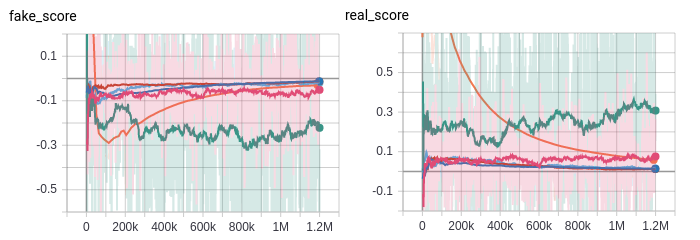

### mixed precision
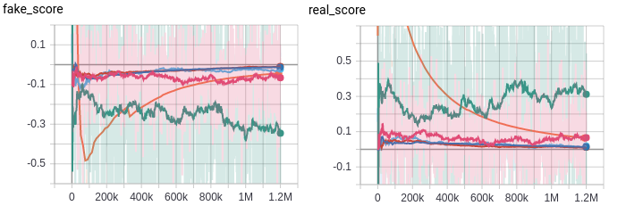

There seems to be no difference in the score.

## Discriminator loss

### fp32 precision
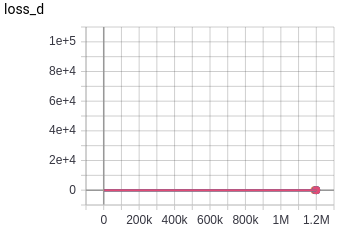

### mixed precision
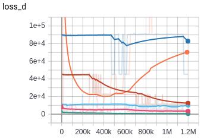

There is a problem with R1 regularization, so training does not work properly. This also affects image samples. It would be better not to use it now.

## Train speed

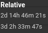

There seems to be a clear speed difference depending on the precision, but it seems to be meaningless because the mixed precision training isn't done properly.

## Inference Images

### 8x8 images
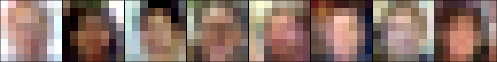
### 16x16 images
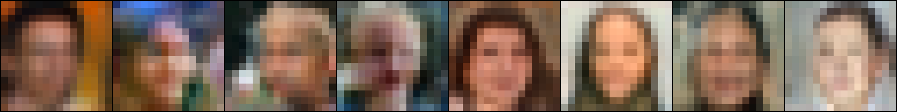
### 32x32 images
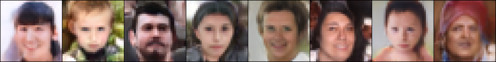
### 64x64 images
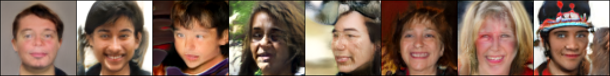
### 128x128 images
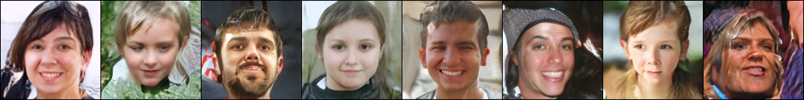
### 256x256 images
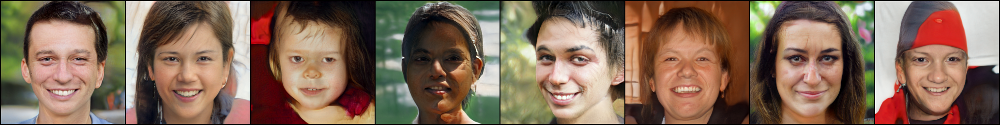

## Pretrained checkpoint

[256x256](https://drive.google.com/file/d/1YDNeDD5G-BI5Zx5RGnlggBMFinp2z8OH/view?usp=sharing)
