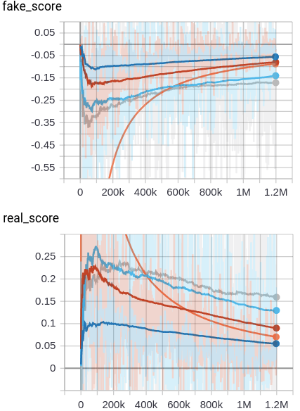

# Pytorch implementation of [A Style-Based Generator Architecture for Generative Adversarial Network](https://arxiv.org/abs/1812.04948)

## Requirements

- fire
- apex
- Python3
- Pytorch 1.0.0
- TensorBoardX

if you want to use apex.amp, visit [this](https://github.com/MakeDirtyCode/StyleGAN-pytorch/tree/amp-support) branch. 

## Usage

train
```
python main.py 
    --config_file=path_to_config_file
    --checkpoint=path_to_config_file[default='']
```

inference
```
python main.py 
    --config_file=path_to_config_file
    --run_type=inference
```

Default configuration file is located in config directory.

## Currently completed task

* [x] Progressive method
* [x] Tuning
* [x] Add mapping and styles 
* [x] Remove traditional input 
* [x] Add noise inputs 
* [ ] Mixing regularization

## Fake image and real image score graph



This seems to be balancing(real_score=fake_score=0), but I think it will require more iteration.

## Inference Images

### 8x8 images

### 16x16 images

### 32x32 images

### 64x64 images

### 128x128 images


As I said above, I think It needs to train more iteration. But my computer is very slow, so it will take more time for the results to be updated.
